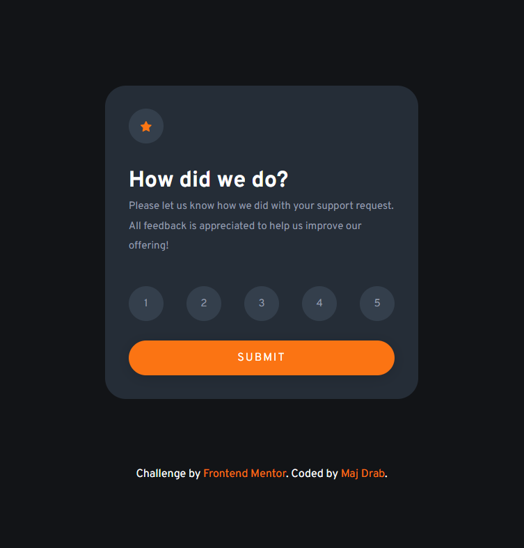

# Frontend Mentor - Interactive rating component solution

This is a solution to the [Interactive rating component challenge on Frontend Mentor](https://www.frontendmentor.io/challenges/interactive-rating-component-koxpeBUmI). Frontend Mentor challenges help you improve your coding skills by building realistic projects.

## Table of contents

-  [Overview](#overview)
   -  [The challenge](#the-challenge)
   -  [Screenshot](#screenshot)
   -  [Links](#links)
-  [My process](#my-process)
   -  [Built with](#built-with)
   -  [What I learned](#what-i-learned)
   -  [Continued development](#continued-development)
-  [Author](#author)

**Note: Delete this note and update the table of contents based on what sections you keep.**

## Overview

### The challenge

Users should be able to:

-  View the optimal layout for the app depending on their device's screen size
-  See hover states for all interactive elements on the page
-  Select and submit a number rating
-  See the "Thank you" card state after submitting a rating

### Screenshot

### Links

-  Solution URL: [Add solution URL here](https://your-solution-url.com)
-  Live Site URL: [https://majdrab.github.io/interactive-rating-component-main/](https://majdrab.github.io/interactive-rating-component-main/)

## My process

### Built with

-  Semantic HTML5 markup
-  CSS custom properties
-  [SASS](https://sass-lang.com/guide)

### What I learned

I've used sass for the first time and it was great. I've also gone through the DOM events again, can't wait to get to know more of JS.

### Continued development

I definitely need to practice more, I'm still quite slow and have to google a lot. I'll try to do as many projects as my time allows.

## Author

-  Website - [Maj Drab](https://majdrab.github.io/)
-  Frontend Mentor - [@majdrab](https://www.frontendmentor.io/profile/majdrab)
